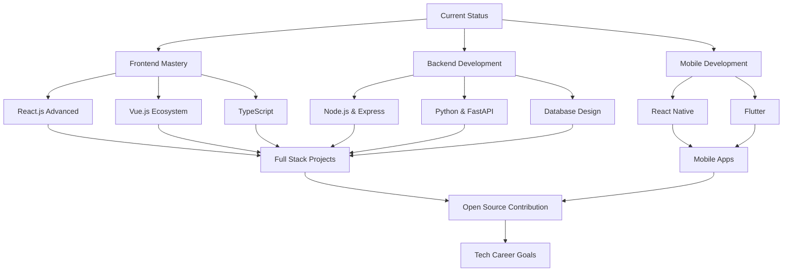

# 👋 Hi there, I'm Alfhin Hidayat!

<div align="center">
  
</div>

<div align="center">
  
</div>

```
    ⠀⠀⠀⠀⠀⠀⠀⠀⠀⣀⣤⣤⣤⣤⣤⣤⣀⠀⠀⠀⠀⠀⠀⠀⠀
    ⠀⠀⠀⠀⠀⠀⠀⢀⣴⠟⠋⠉⠉⠉⠉⠙⠻⣦⡀⠀⠀⠀⠀⠀⠀
    ⠀⠀⠀⠀⠀⠀⢀⣾⠋⠀⠀⠀⠀⠀⠀⠀⠀⠀⠙⣷⡀⠀⠀⠀⠀
    ⠀⠀⠀⠀⠀⠀⣾⠃⠀⠀⠀⠀⠀⠀⠀⠀⠀⠀⠀⠘⣷⠀⠀⠀⠀
    ⠀⠀⠀⠀⠀⢸⡏⠀⠀⠀⢀⣀⣀⣀⣀⡀⠀⠀⠀⠀⢹⡇⠀⠀⠀
    ⠀⠀⠀⠀⠀⢸⡇⠀⠀⠀⢸⣿⣿⣿⣿⡇⠀⠀⠀⠀⢸⡇⠀⠀⠀   "Coding is like anime - 
    ⠀⠀⠀⠀⠀⢸⡇⠀⠀⠀⠈⠛⠛⠛⠛⠁⠀⠀⠀⠀⢸⡇⠀⠀⠀    it gets better with time!"
    ⠀⠀⠀⠀⠀⠘⣷⠀⠀⠀⠀⠀⠀⠀⠀⠀⠀⠀⠀⠀⣾⠃⠀⠀⠀         - Alfhin 2024
    ⠀⠀⠀⠀⠀⠀⠙⣷⡀⠀⠀⠀⠀⠀⠀⠀⠀⠀⠀⣾⠋⠀⠀⠀⠀
    ⠀⠀⠀⠀⠀⠀⠀⠀⠙⠻⣦⣄⣀⣀⣀⣀⣠⣴⠟⠋⠀⠀⠀⠀⠀
    ⠀⠀⠀⠀⠀⠀⠀⠀⠀⠀⠀⠉⠛⠛⠛⠛⠉⠀⠀⠀⠀⠀⠀⠀⠀
```

<div align="center">
  
  
  
</div>

### 🎮 Anime & Gaming Projects
<div align="center">
  
  
  
  
</div>

### 🌐 Anime Web Projects (Coming Soon)
<div align="center">
  
  
</div>

> **MyAnimeList Clone** - Personal anime tracking system with recommendations

**Planned Features:**
- 📺 Anime database with ratings & reviews
- 🎯 Personal watchlist & progress tracking
- 🤖 AI-powered anime recommendations
- 👥 Social features for otaku community
- 📊 Advanced statistics & analytics
- 🎮 Integration with gaming platforms

---

### 🎌 Waifu Randomizer API
<div align="center">
  
  
</div>

> **REST API untuk random waifu images** with personality matching

**Features:**
- 🎲 Random waifu generator
- 🔍 Search by anime series
- ⭐ Rating & favorite system
- 🎨 Character personality profiles
- 📱 Mobile app integration ready

---

## 🚀 About Me

```javascript
const alfhin = {
    name: "Alfhin Hidayat",
    location: "Pekanbaru, Riau, Indonesia 🇮🇩",
    education: "Computer Science Student at UMRI",
    currentlyLearning: ["React.js", "Vue.js", "Python", "Machine Learning", "DevOps"],
    hobbies: ["Coding", "Gaming", "Music", "Anime", "Technology"],
    funFact: "I often do things spontaneously, especially when I'm bored! 🎯",
    motto: "Code with passion, create with purpose! ✨"
};
```

- 🎓 **Student** at University of Muhammadiyah Riau
- 💻 **Full Stack Developer** in the making
- 🌱 Currently learning **React.js**, **Vue.js**, **Python**, and **Machine Learning**
- 🤝 Open to **collaboration** and **mentorship opportunities**
- 🎯 Goal: Contributing to **open source** and building **impactful projects**
- 📫 Reach me at **[230401150@student.umri.ac.id](mailto:230401150@student.umri.ac.id)**
- ⚡ **Fun fact**: I love Billie Eilish and built a website to find your oshi! 🎭

---

## 🛠️ Tech Stack & Skills

### 💻 Programming Languages
<div align="center">
  
  
  
  
  
  
  
</div>

### 🌐 Frontend Development
<div align="center">
  
  
  
  
  
  
  
  
</div>

### ⚙️ Backend Development
<div align="center">
  
  
  
  
  
  
</div>

### 🗄️ Databases & Cloud
<div align="center">
  
  
  
  
  
  
  
</div>

### 🛠️ Tools & Technologies
<div align="center">
  
  
  
  
  
  
  
  
</div>

---

## 📊 GitHub Analytics

<div align="center">
  
  
</div>

<div align="center">
  
</div>

<div align="center">
  
</div>

---

## 🚀 Featured Projects

# 🛍️ Fhinz Store

**Fhinz Store** adalah website toko online sederhana dengan tampilan modern dan responsif. Cocok digunakan sebagai template awal untuk proyek e-commerce skala kecil hingga menengah.

## ✨ Fitur

- 📱 Tampilan responsif (mobile-friendly)
- 🎨 Desain antarmuka modern
- 🛒 Halaman produk
- 🔗 Navigasi sederhana

## 🧰 Teknologi

- ⚙️ HTML5  
- 🎨 CSS3  
- 💡 JavaScript

---

### 🎵 Music Mood App
<div align="center">
  
  
  
</div>

> **Music recommendation based on your mood and coding session** 🎧  
> Curated playlists mixing Hip-Hop, Alternative Rock, and Pop for different coding moods.

**Planned Features:**
- 🎯 Mood-based music recommendations
- 🎵 Integration with Spotify API
- 🎤 Artist spotlight (Billie Eilish, Chase Atlantic, Lil Uzi)
- ⚡ Real-time music sync with coding productivity
- 📊 Music listening analytics

---

### 🌐 Portfolio Website
<div align="center">
  
  
  
</div>

> **Modern portfolio website** showcasing my projects, skills, and journey as a developer.

**Features:**
- ⚡ Built with React.js & Next.js
- 🎨 Modern design with Tailwind CSS
- 📱 Fully responsive design
- 🌙 Dark/Light mode toggle
- 📧 Contact form integration
- 🚀 Optimized performance

---

### 📚 Learning Management System
<div align="center">
  
  
  
</div>

> **Full-stack LMS** for university students and teachers to manage courses, assignments, and grades.

**Planned Features:**
- 👥 User authentication & role management
- 📝 Course management system
- 📊 Grade tracking & analytics
- 💬 Real-time chat & discussions
- 📱 Progressive Web App (PWA)
- 🔔 Push notifications

---

## 📈 Contribution Graph

<div align="center">
  
</div>

---

## 🏆 GitHub Achievements

<div align="center">
  
</div>

<div align="center">
  
  
</div>

---

## 🎯 Current Goals & Learning Path



### 🎯 2024 Goals
- [ ] Master React.js ecosystem (Redux, Context API, Hooks)
- [ ] Learn Python for backend development
- [ ] Build 5 major full-stack projects
- [ ] Contribute to 10 open source projects
- [ ] Learn DevOps fundamentals (Docker, CI/CD)
- [ ] Get AWS Cloud Practitioner certification
- [x] Create personal portfolio website
- [x] Launch Cekoshi project

---

## 📚 Latest Blog Posts & Learning

<div align="center">
  
  
  
</div>

### 📖 Currently Reading:
- 🚀 "Clean Code" by Robert C. Martin
- 💻 "JavaScript: The Good Parts" by Douglas Crockford
- 🎯 "System Design Interview" by Alex Xu
- 🌐 "You Don't Know JS" series

### 🎓 Online Courses in Progress:
- **freeCodeCamp**: Full Stack Web Development
- **Coursera**: Machine Learning by Andrew Ng
- **Udemy**: Docker & Kubernetes
- **Pluralsight**: React.js Advanced Patterns

---

## 🌟 Fun Facts & Interests

<div align="center">
  
  
  
</div>

### 🎌 Anime Waifu Collection
<div align="center">
  
  
  
</div>

```javascript
const otaku_life = {
  current_status: "Watching anime while coding 🖥️✨",
  power_level: "Over 9000! 💪",
  favorite_genres: ["Shounen", "Romance", "Slice of Life", "Isekai"],
  currently_watching: [
    "Jujutsu Kaisen Season 2 🔥",
    "Demon Slayer: Hashira Training Arc ⚔️",
    "My Hero Academia Season 7 🦸‍♂️"
  ],
  all_time_favorites: [
    "🗡️ Attack on Titan - Shinzou wo Sasageyo!",
    "🔥 Demon Slayer - Breathing techniques in coding",
    "💝 Your Name - Time manipulation debugging",
    "⚡ One Piece - Never ending adventure like my code",
    "🎯 Naruto - Believe it! (in clean code)",
    "🏀 Kuroko no Basket - Teamwork makes the dream work"
  ],
  coding_soundtrack: [
    "🎵 Hip-Hop/Rap (Lil Uzi Vert - 20 Min, ScHoolboy Q, Thai Rap)",
    "🎶 Pop/R&B (Flo Rida - Sugar, Tinashe - 2 On)",
    "🎸 Alternative Pop/Rock (Chase Atlantic - Swim, Into It, Consume)",
    "🎹 Billie Eilish discography on repeat"
  ],
  waifu_tier_list: "Classified information 🤫",
  husbando_picks: ["Levi Ackerman", "Tanjiro", "Gojo Satoru"],
  anime_quote: "\"The only one who can beat me is me!\" - Aomine Daiki 🏀"
};
```

### 🎮 Otaku Gaming Stats
```
┌─────────────────────────────────────────────┐
│  🎯 Genshin Impact AR: 57 (Raiden Shogun main) │
│  ⚔️ Honkai Impact: Captain Level 80+        │
│  📱 Blue Archive: Sensei since Day 1        │
│  🎴 Azur Lane: Admiral with 500+ ships      │
│  🌟 Love Live: All Stars Master rank        │
└─────────────────────────────────────────────┘
```

### 📺 Anime Watching Progress
<div align="center">


</div>

### 🎌 Seasonal Anime Tracker
```
Spring 2024:
████████████████████████ 100% - Demon Slayer
██████████████████████▓▓ 90%  - My Hero Academia  
████████████████▓▓▓▓▓▓▓▓ 70%  - Kaiju No. 8
████████████▓▓▓▓▓▓▓▓▓▓▓▓ 50%  - Wind Breaker

Currently Binge Watching:
🔄 Re-watching Attack on Titan (for the 5th time)
🆕 Chainsaw Man (preparing for Season 2)
📚 Reading Jujutsu Kaisen manga ahead of anime
```

### 🏆 Otaku Achievements
- 🎖️ **Anime Veteran**: Watched 300+ anime series
- 🥇 **Manga Reader**: Read 150+ manga titles  
- 🎯 **Gacha Master**: F2P but still gets SSR units
- 🎵 **OST Collector**: 1000+ anime songs in playlist
- 🎨 **Waifu Protector**: Desktop filled with anime wallpapers
- 📱 **Mobile Otaku**: 10+ anime games installed
- 🎪 **Convention Attendee**: Been to anime conventions
- 💻 **Coding Weeb**: Uses anime variable names in code

```json
{
  "interests": [
    "🎮 Gaming (Gacha games, FPS, RPG)",
    "🎵 Music (Hip-Hop/Rap, Pop/R&B, Alternative Rock)",
    "🎤 Billie Eilish & Modern Pop Culture",
    "📱 Latest Technology & Music Apps",
    "🏃‍♂️ Running while listening to Chase Atlantic",
    "📸 Photography (especially concert & music vibes)",
    "🎬 Anime, Manga & Music Videos",
    "☕ Coffee & Late-night coding with Lil Uzi beats"
  ],
  "favorite_games": ["Genshin Impact", "Valorant", "Blue Archive", "Honkai Impact"],
  "favorite_anime": ["Attack on Titan", "Demon Slayer", "Your Name", "JJK", "MHA"],
  "coding_music": ["Hip-Hop/Rap", "Alternative Pop/Rock", "Billie Eilish", "Chase Atlantic"],
  "coffee_preference": "Strong black coffee while vibing to music ☕🎵"
}
```

---

## 🌐 Connect & Collaborate

<div align="center">
  <a href="mailto:230401150@student.umri.ac.id">
    
  </a>
  <a href="https://instagram.com/fhinz_anxiety">
    
  </a>
  <a href="https://github.com/Fhynn">
    
  </a>
  <a href="https://linkedin.com/in/alfhin-hidayat">
    
  </a>
  <a href="https://twitter.com/alfhinhidayat">
    
  </a>
  <a href="https://discord.gg/alfhin#1234">
    
  </a>
</div>

### 💬 Let's Talk About:
- 💻 **Web Development** - Frontend, Backend, Full Stack
- 🤖 **Technology Trends** - AI, Machine Learning, Web3
- 🎯 **Career Advice** - Student life, learning paths
- 🎮 **Gaming** - Latest games, esports
- 🎵 **Music** - Hip-Hop, Alternative Rock, Billie Eilish
- ☕ **Anything over coffee!**

---

## 💖 Support My Work

<div align="center">
  <a href="https://ko-fi.com/alfhinhidayat">
    
  </a>
  <a href="https://www.buymeacoffee.com/alfhinhidayat">
    
  </a>
</div>

If you find my projects helpful or interesting, consider:
- ⭐ **Starring** my repositories
- 🍴 **Forking** and contributing
- 💬 **Sharing** with your network
- ☕ **Buying me a coffee** to fuel more coding sessions!

---

<div align="center">
  
</div>

```
⠀⠀⠀⠀⠀⠀⠀⠀⠀⠀⠀⠀⠀⠀⠀⠀⠀⠀⠀⣀⣤⣶⣶⣿⣿⣿⣿⣶⣶⣤⣀⠀⠀⠀⠀⠀⠀⠀⠀⠀⠀⠀⠀⠀⠀⠀⠀⠀⠀⠀⠀
⠀⠀⠀⠀⠀⠀⠀⠀⠀⠀⠀⠀⠀⠀⠀⠀⢀⣴⣿⣿⣿⣿⣿⣿⣿⣿⣿⣿⣿⣿⣿⣿⣦⡀⠀⠀⠀⠀⠀⠀⠀⠀⠀⠀⠀⠀⠀⠀⠀⠀⠀
⠀⠀⠀⠀⠀⠀⠀⠀⠀⠀⠀⠀⠀⠀⢀⣴⣿⣿⣿⣿⣿⣿⣿⣿⣿⣿⣿⣿⣿⣿⣿⣿⣿⣿⣦⡀⠀⠀⠀⠀⠀⠀⠀⠀⠀⠀⠀⠀⠀⠀⠀
⠀⠀⠀⠀⠀⠀⠀⠀⠀⠀⠀⠀⢀⣾⣿⣿⣿⣿⣿⣿⣿⣿⣿⣿⣿⣿⣿⣿⣿⣿⣿⣿⣿⣿⣿⣷⡀⠀⠀⠀⠀⠀⠀⠀⠀⠀⠀⠀⠀⠀⠀
⠀⠀⠀⠀⠀⠀⠀⠀⠀⠀⠀⢀⣿⣿⣿⣿⣿⣿⣿⣿⣿⣿⣿⣿⣿⣿⣿⣿⣿⣿⣿⣿⣿⣿⣿⣿⣿⡀⠀⠀⠀⠀⠀⠀⠀⠀⠀⠀⠀⠀⠀
⠀⠀⠀⠀⠀⠀⠀⠀⠀⠀⠀⣾⣿⣿⣿⣿⣿⣿⣿⣿⣿⣿⣿⣿⣿⣿⣿⣿⣿⣿⣿⣿⣿⣿⣿⣿⣿⣷⠀⠀⠀⠀⠀⠀⠀⠀⠀⠀⠀⠀⠀   "Whether you win or lose, 
⠀⠀⠀⠀⠀⠀⠀⠀⠀⠀⢸⣿⣿⣿⣿⣿⣿⣿⣿⣿⣿⣿⣿⣿⣿⣿⣿⣿⣿⣿⣿⣿⣿⣿⣿⣿⣿⣿⡇⠀⠀⠀⠀⠀⠀⠀⠀⠀⠀⠀⠀    you can always be better
⠀⠀⠀⠀⠀⠀⠀⠀⠀⠀⢸⣿⣿⣿⣿⣿⣿⣿⣿⣿⣿⣿⣿⣿⣿⣿⣿⣿⣿⣿⣿⣿⣿⣿⣿⣿⣿⣿⡇⠀⠀⠀⠀⠀⠀⠀⠀⠀⠀⠀⠀    tomorrow than you 
⠀⠀⠀⠀⠀⠀⠀⠀⠀⠀⠘⣿⣿⣿⣿⣿⣿⣿⣿⣿⣿⣿⣿⣿⣿⣿⣿⣿⣿⣿⣿⣿⣿⣿⣿⣿⣿⣿⠃⠀⠀⠀⠀⠀⠀⠀⠀⠀⠀⠀⠀    were today!"
⠀⠀⠀⠀⠀⠀⠀⠀⠀⠀⠀⢿⣿⣿⣿⣿⣿⣿⣿⣿⣿⣿⣿⣿⣿⣿⣿⣿⣿⣿⣿⣿⣿⣿⣿⣿⣿⡿⠀⠀⠀⠀⠀⠀⠀⠀⠀⠀⠀⠀⠀     - Hinata Shoyo 🏐
⠀⠀⠀⠀⠀⠀⠀⠀⠀⠀⠀⠈⢿⣿⣿⣿⣿⣿⣿⣿⣿⣿⣿⣿⣿⣿⣿⣿⣿⣿⣿⣿⣿⣿⣿⣿⡿⠁⠀⠀⠀⠀⠀⠀⠀⠀⠀⠀⠀⠀⠀
⠀⠀⠀⠀⠀⠀⠀⠀⠀⠀⠀⠀⠈⠻⣿⣿⣿⣿⣿⣿⣿⣿⣿⣿⣿⣿⣿⣿⣿⣿⣿⣿⣿⣿⣿⠟⠁⠀⠀⠀⠀⠀⠀⠀⠀⠀⠀⠀⠀⠀⠀
⠀⠀⠀⠀⠀⠀⠀⠀⠀⠀⠀⠀⠀⠀⠈⠛⢿⣿⣿⣿⣿⣿⣿⣿⣿⣿⣿⣿⣿⣿⣿⣿⡿⠛⠁⠀⠀⠀⠀⠀⠀⠀⠀⠀⠀⠀⠀⠀⠀⠀⠀
⠀⠀⠀⠀⠀⠀⠀⠀⠀⠀⠀⠀⠀⠀⠀⠀⠀⠈⠙⠛⠿⠿⣿⣿⣿⣿⠿⠿⠛⠋⠁⠀⠀⠀⠀⠀⠀⠀⠀⠀⠀⠀⠀⠀⠀⠀⠀⠀⠀⠀⠀
⠀⠀⠀⠀⠀⠀⠀⠀⠀⠀⠀⠀⠀⠀⠀⠀⠀⠀⠀⠀⠀⠀⠀⠀⠀⠀⠀⠀⠀⠀⠀⠀⠀⠀⠀⠀⠀⠀⠀⠀⠀⠀⠀⠀⠀⠀⠀⠀⠀⠀⠀
```

<div align="center">
  
</div>

---

<div align="center">
  <i>⭐ From <a href="https://github.com/Fhynn">Fhynn</a> with ❤️</i>
</div>
